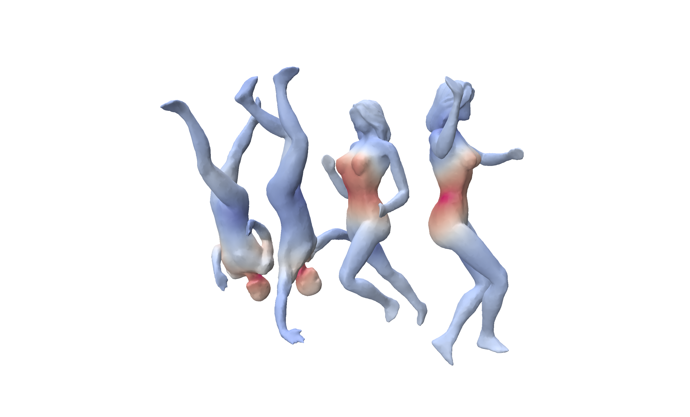

# GeoInspect

Mesh-aware explainability for DiffusionNet on triangular meshes.

<p align="center">
  
</p>
<p align="center">
  <em>Integrated Gradients on 4 SHREC11 meshes (2 men, 2 women), using a lightly diffused heat baseline.</em>
</p>

## What This Project Is

GeoInspect is an XAI toolkit designed for geometric deep learning on meshes.
It provides explainability methods that are adapted to mesh geometry through mass weighting, Laplace-Beltrami operators, and spectral/heat smoothing.

It is built to work directly with DiffusionNet checkpoints.

## What You Get

- Mesh-aware Saliency
- Mesh-aware Integrated Gradients (including heat/spectral baselines)
- Intrinsic Grad-CAM for mesh activations
- Interactive Polyscope visualization with map/method selection and `t (tau)` slider
- End-to-end script for trained DiffusionNet models

## Install

From repository root:

```bash
python -m venv .venv
source .venv/bin/activate
pip install -U pip
pip install -e .
```

Recommended extras:

```bash
pip install -e ".[diffusionnet,viz,test]"
```

## Core Mesh Formulation

Let:

- mesh vertices/features be $X \in \mathbb{R}^{N \times C}$
- mass vector be $m \in \mathbb{R}^{N}_{+}$
- Laplace-Beltrami discretization be $L$
- target class logit be $f_c(X)$

Heat-based smoothing (implicit discretization):

$$
X_{\tau} = (I + \tau L)^{-1} X
$$

This is the discrete counterpart of heat diffusion and is used as a smooth baseline or post-processing operator.

## XAI Methods (Direct API)

All explainers use the same call pattern:

```python
result = explainer.explain(
    features=features,      # torch.Tensor, typically [N, C]
    operators=operators,    # MeshOperators
    target=target_idx,      # class index, callable, or target spec
)
```

### 1) Saliency (Mesh-Aware)

$$
S_i = \left\lVert \frac{\partial f_c}{\partial x_i} \right\rVert_2,
\quad
\widetilde{S}_i = m_i\,S_i
$$

```python
from geoinspect import SaliencyConfig, SaliencyExplainer

saliency = SaliencyExplainer(
    model,
    SaliencyConfig(
        aggregation="l2",
        mass_normalize=True,
        smooth="heat",
        smooth_tau=0.02,
        smooth_num_modes=64,
        normalize=None,
        prefer_operator_signature=True,
        forward_kwargs={"faces": faces},
    ),
)
result = saliency.explain(features=features, operators=operators, target=target_idx)
```

Key options:
- `aggregation`: `l2`, `l1`, `abs_sum`, or `signed`
- `mass_normalize`: divide vertex gradients by local mass
- `baseline`: with `aggregation="signed"`, choose `zero`, `mean`, `heat`, or `spectral_lowpass`
- `smooth`: `none`, `heat`, or `helmholtz` (`smooth_tau`, `smooth_num_modes`)

### 2) Integrated Gradients (Mesh-Aware + Heat Baseline)

Heat baseline:

$$
X^{(0)} = (I + \tau L)^{-1}X
$$

Integrated gradients:

$$
\mathrm{IG}_i =
\left(x_i - x_i^{(0)}\right)
\cdot
\frac{1}{K}
\sum_{k=1}^{K}
\frac{\partial f_c\!\left(X^{(0)} + \frac{k}{K}(X-X^{(0)})\right)}{\partial x_i}
$$

Mass-weighted completeness check:

$$
\sum_{i=1}^{N} m_i\,\mathrm{IG}_i \approx f_c(X) - f_c\!\left(X^{(0)}\right)
$$

```python
from geoinspect import IntegratedGradientsConfig, IntegratedGradientsExplainer

ig = IntegratedGradientsExplainer(
    model,
    IntegratedGradientsConfig(
        steps=48,
        baseline="heat",
        baseline_kwargs={"tau": 0.03, "num_modes": 64},
        mass_normalize_gradients=True,
        return_channelwise=False,
        smooth="heat",
        smooth_tau=0.01,
        prefer_operator_signature=True,
        forward_kwargs={"faces": faces},
    ),
)
result = ig.explain(features=features, operators=operators, target=target_idx)
```

Key options:
- `steps`: number of integration points along the path
- `baseline`: `zero`, `mean`, `heat`, or `spectral_lowpass`
- `baseline_kwargs`: for example `tau` and `num_modes`
- `mass_normalize_gradients`: mass-aware gradient normalization before integration
- `return_channelwise`: keep channel-level IG instead of collapsing to scalar per vertex

### 3) Intrinsic Grad-CAM (Mesh-Aware)

For layer activations $A \in \mathbb{R}^{N \times C_a}$:

$$
\alpha_k =
\frac{\sum_i m_i\,\frac{\partial f_c}{\partial A_{ik}}}
{\sum_i m_i}
$$

$$
\mathrm{CAM}_i = \sum_{k=1}^{C_a} \alpha_k\,A_{ik}
$$

```python
from geoinspect import GradCAMConfig, IntrinsicGradCAMExplainer

gradcam = IntrinsicGradCAMExplainer(
    model,
    GradCAMConfig(
        target_layer="block_3.mlp",  # adapt to your model module path
        mass_weighted=True,
        signed=True,
        use_relu=False,
        smooth="heat",
        smooth_tau=0.02,
        return_channel_weights=True,
        prefer_operator_signature=True,
        forward_kwargs={"faces": faces},
    ),
)
result = gradcam.explain(features=features, operators=operators, target=target_idx)
```

Key options:
- `target_layer`: module path where activations are captured
- `mass_weighted`: use mass-weighted averaging for channel importance
- `signed` / `use_relu`: signed CAM or positive-only CAM behavior
- `return_channel_weights`: expose per-channel weights in `result.metadata`

## Repository Layout

- `src/geoinspect/` : core library code
- `examples/` : runnable examples and sanity scripts
- `tests/` : tests
- `third_party/diffusion-net/` : DiffusionNet source used for experiments
- `images/` : README assets

## Examples Guide

For a compact command-by-command guide:

- see [examples/README.md](examples/README.md)

## Citation

>*Sharp, N., Attaiki, S., Crane, K., and Ovsjanikov, M. 2022. *DiffusionNet: Discretization Agnostic Learning on Surfaces*. **ACM Transactions on Graphics** 41(3), 27:1-27:16. https://doi.org/10.1145/3507905*

## Testing

```bash
pytest tests -q
```
